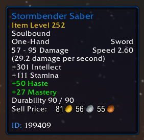

# ManiaTip

ManiaTip modifies the World of Warcraft tooltip.

## Features
- Display IDs (item, spell etc.)
- Display health values on the healthbar
- Colored tooltip borders based on class, reaction, quality.
- Ability to change the healthbar texture
- Ability to change the tooltip font
- Ability to change the tooltip background color
- Ability to hide the 'PvP' text
- Ability to hide the 'Horde' and 'Alliance' text
- Ability to hide the faction of an NPC

## Screenshots

